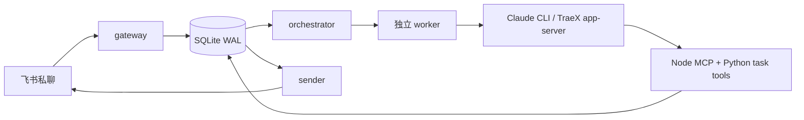

# Feishu LLM Bot 通用运行时设计

版本：0.3.0，2026-10-08。迁移包中的技术方案；开发主项目还保留完整的部署沿革与进展。

## 目标与结构

每个 OS 用户通过自己的飞书自建机器人，使用本机 Claude Code 或 TraeX 的会话历史和工具。
Python 负责飞书协议、持久队列、执行监督和投递；Node MCP 为模型提供受管工具；模型 CLI
沿用用户在该机器的登录。每个 bot 实例单用户、私聊、单业务执行槽。



gateway 独立处理 `/status`、`/queue`、`/cancel`、`/continue` 和 `/result`。
orchestrator 领取 attempt 后生成私有 request，worker 负责后端协议，最终答案和 outbox
在同一事务提交。sender 独立更新同一张进度/结果卡。执行结束即可释放业务槽，投递失败独立重试。

## 后端与会话

| 项目 | Claude | TraeX |
|---|---|---|
| 入口 | claude / claude-w --print --output-format stream-json | traex / traecli app-server --listen stdio:// |
| 继承 | --resume UUID --fork-session | thread/fork(threadId)，不修改原 thread |
| 新建 | 不传 resume | thread/start |
| 执行 | 从 stdin 接收 prompt | turn/start，并选择 feishu MCP 能力 |
| 事件 | init、tool_use/tool_result、result | thread/turn/item 通知，归一为宿主事件 |
| 完成 | 有效非空最终结果或 MCP reply | 精确匹配 thread/turn 的 completed 与最终消息或 MCP reply |
| 本地观察 | CLI 自有 JSONL | attempt 目录 events.jsonl；不保存 reasoning |

每个 attempt 使用新物理会话。只有成功会话提升为 runtime_meta.session_id；失败分支不污染下一
任务基点。配置中的 session_id 只用于首次初始化。数据库额外绑定 agent_backend，不允许原地
切换后端和复用不兼容会话。没有指定模型时保留 CLI 的有效默认值。

TraeX 采用自己拥有的 stdio app-server，避免共享 daemon 的生命周期脱离 worker。RPC 有记录
大小、通知队列和硬期限限制。仅当前 thread/turn 的事件可以更新本次任务；收到终态后收尾，
取消或身份过期时拒绝新受管调用。未适配协议快速失败，诊断只存私有任务目录。

## 身份、操作和恢复

events.sequence 是飞书任务编号；correlation_id 连接输入和任务；attempt_id 与 token 标识
当前执行；result_id 标识独立交付版本。取消先撤销执行身份，再停止并核验 worker，最后释放槽。
旧 token、跨任务或迟到结果不能提交。unknown 写操作必须先核验，不能换 key 绕过。

默认受管工具为 reply、read_image、operations、read_artifact 和 run。documents / libra 是
可选集成；未启用时，工具目录、prompt 和宿主 invoke 都拒绝这些接口。通用 run 保存命令输出、
退出状态和回执；相同任务同 operation_key 的成功操作复用结果。不保证任意外部写入 exactly-once。

Claude 使用本次 worker 的 hook 校验身份并授权；TraeX 原生权限按 workspace/full 配置处理，
受管 MCP 工具始终检查 attempt。TraeX 原生工具权限与 MCP 宿主权限不同，见安装文档。
TraeX 在开始执行前保守标记 unsafe，避免无 hook 保证的原生操作被自动重放。

默认单次硬期限 1200 秒、累计自动预算 1800 秒、启动 180 秒、无活动 300 秒；收尾预留 90 秒。
硬期限与取消由宿主执行，软期限下受管工具停止新工作、允许读取已有成果及提交答案。

## 进程、部署和数据

setup_cli 提供 init / doctor / probe / run / status / service-files。init 动态生成所有路径，
保存当前 Python、Node、模型 CLI、PATH 和显式配置目录。App Secret 只保存在私有 credentials.json。
服务文件按实例路径摘要命名，systemd 或 launchd 负责重新拉起 supervisor；supervisor 维护
gateway/orchestrator/sender 三个子进程。Linux 可沿用三个独立 systemd 服务部署。

systemd worker 使用独立 cgroup；POSIX worker 使用保留 session leader 的 guardian，保存 PID
和完整 ps 启动身份。守护器启动握手前不能执行业务。恢复时确认身份，清理普通 session 成员；
不能确认清理时维持隔离。POSIX 方案不覆盖主动 daemonize 逃逸；cgroup 隔离仅 Linux 可用。

状态目录：runtime.json、env、credentials.json、bot.sqlite3、resident、progress、tasks、
attachments。运行库采用 WAL，legacy schema=6 / runtime schema=2，本次未改 schema。
后端绑定采用已有 meta。读取状态用 mode=ro；备份用 SQLite backup API 与关联文件一致快照。

## 验证与维护

`python3 scripts/install.py --dev` 后运行：

```bash
PYTHONPATH=src .venv/bin/pytest -o addopts='' -q
.venv/bin/ruff check src tests scripts
node node-channel/worker-smoke-test.mjs
node node-channel/inbox-test.mjs
node node-channel/smoke-test.mjs
```

`feishu-bot probe --config ...` 验证真实模型、受管命令和分叉继承，使用隔离状态，不发飞书消息。
macOS、目标用户的租户权限和 CLI 登录须在目标机器验收，不能由 Linux 单元测试替代。
每次开发同步修改本文与发布记录，区分代码实现、隔离验证与生产上线状态。
